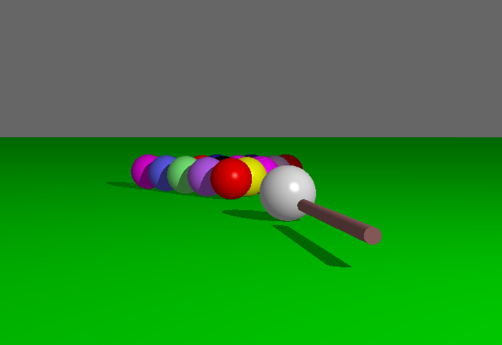
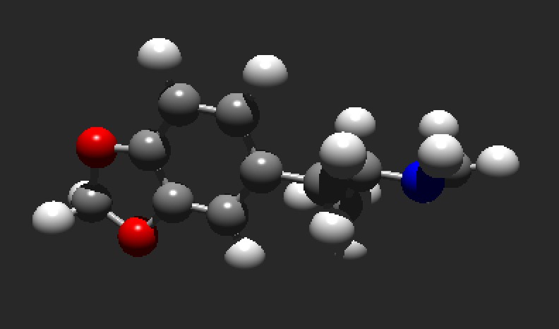
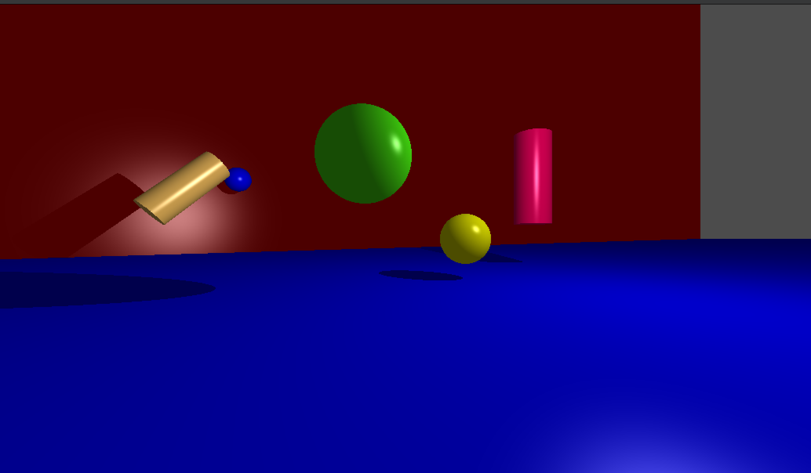

# miniRT

miniRT is a simple Ray Tracing engine implemented as part of the 42 curriculum. The goal of this project is to create a basic ray tracer that renders 3D scenes with basic shapes like spheres, planes, and cylinders, using the mathematical concepts of ray tracing.

## Features

- Ray tracing of basic 3D shapes (spheres, planes, cylinders)
- Lighting and shadows
- Reflections and basic color handling
- Output rendered image in PPM format
